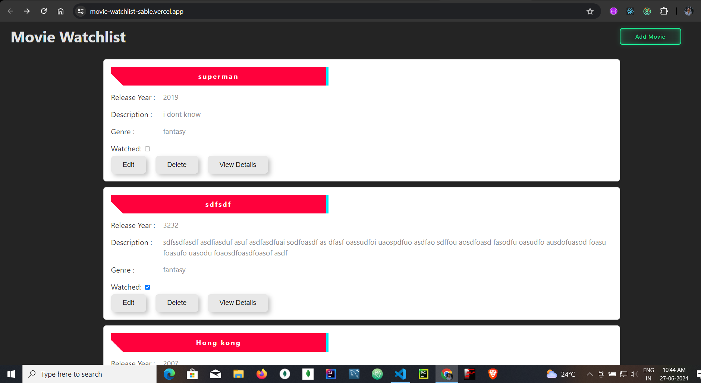
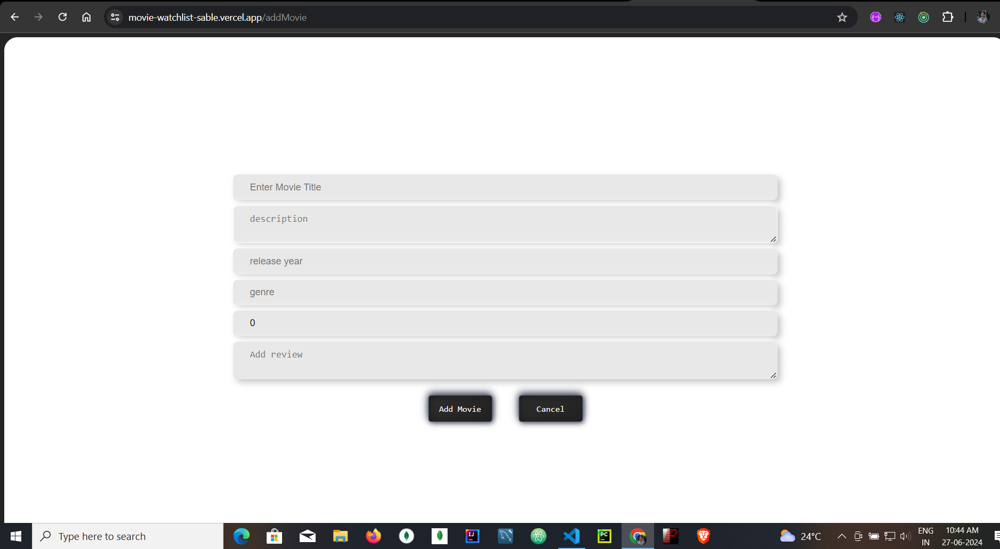
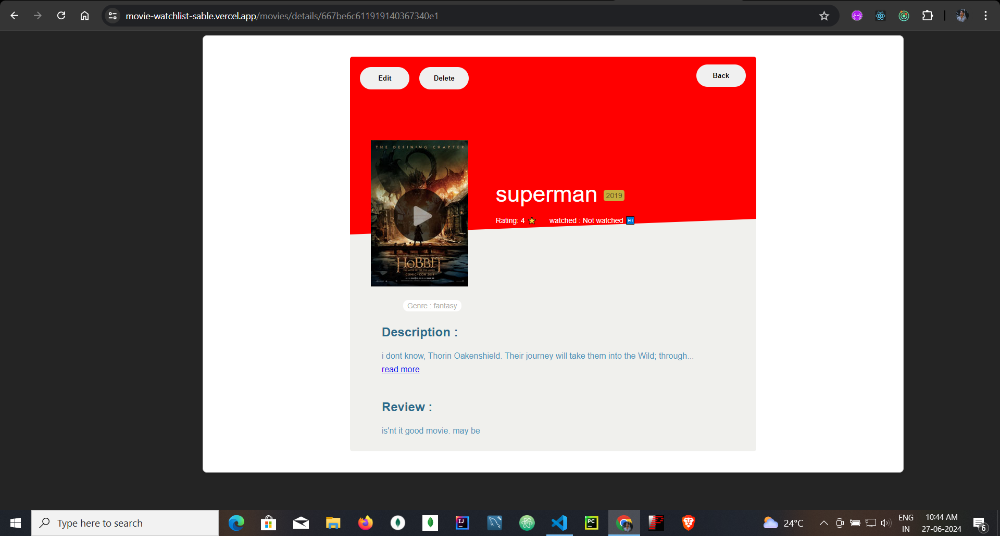

# MOVIE WATCHLIST ( MERN web application frontend + backend)

## Visit the live sites given below for demo

### \* LIVE [Frontend](https://movie-watchlist-sable.vercel.app/) => https://movie-watchlist-sable.vercel.app/

### \* LIVE [Backend](https://movie-watchlist-backend.vercel.app/) => https://movie-watchlist-backend.vercel.app/

## Introduction

The Movie Watchlist application is a web-based tool that allows users to manage a list of movies they want to watch. Users can add, edit, and delete movies from their watchlist, mark movies as watched or unwatched, and rate and review movies. State management will be handled using Redux to ensure efficient and predictable state updates.

Project consists of three main parts:

- **Front End:** The user interface with list of movies, and buttons to add or edit movie and display movie details.
- **Back End:** The server-side application managing the database, handling requests, and providing APIs.

## Technologies Used

- **Frontend:** React, Vite
- **Backend:** Node.js
- **State Management:** Redux state management library.
- **Database:** MongoDB (Mongodb Atlas).

## NOTE:

- Make sure to install latest version of Node.js, Mongodb, and React.js.
- Make sure to create account in Mongodb Atlas and Note the password of the cluster. Add Ip address 0.0.0.0 to allow request from any address.

## Features:

### Add Movies:

- Users can add movies to their watchlist by providing details such as the movie title, description, release year, and genre.
- Each movie should have a unique identifier.

### Edit Movies:

- Users can edit the details of movies already in their watchlist.

### Delete Movies:

- Users can delete movies from their watchlist.

### Mark Movies as Watched/Unwatched:

- Users can toggle the status of a movie between watched and unwatched.

### Rate and Review Movies:

- Users can rate movies on a scale of 1 to 5 stars.
- Users can provide a text review for each movie.

### State Management with Redux:

- All state changes (adding, editing, deleting movies, marking as watched/unwatched, rating, and reviewing) will be managed using Redux.

## Installation:

-> Follow the below steps

**1.Clone the repository:**

```bash
git clone https://github.com/Tosif145/movie-watchlist.git
cd movie-watchlist
```

**2.Install Dependencies:** change directory to the respective section and use the below command.

```bash
 npm install
```

**Note:** if you face error while installing in front end use below command

```bash
    npm install --legacy-peer-deps
```

**3.Set Up Environment Variables:** add in .env file. (backend > .env )

```bash
MONGODB_URI=mongodb+srv://<name>:<password>@cluster0.lsxrsze.mongodb.net/movie-watchlist
PORT=5000
```

**4.Run the Application:** change directory to the respective section and use the below command in different terminals.

```bash
cd backend
npm run dev

cd frontend
npm run dev

```

## Snapshots

### App Frontend:

- **Home Page :**

  

- **Add/Edit Movie:**

  

- **Movie details display:**

  


## End points:
   * These are the end point collection with request methods to test the backend. (You can use Thunder client in vs coode or Postman API )
   [API end point collection](./thunder-collection_movie-watchlist.json)
